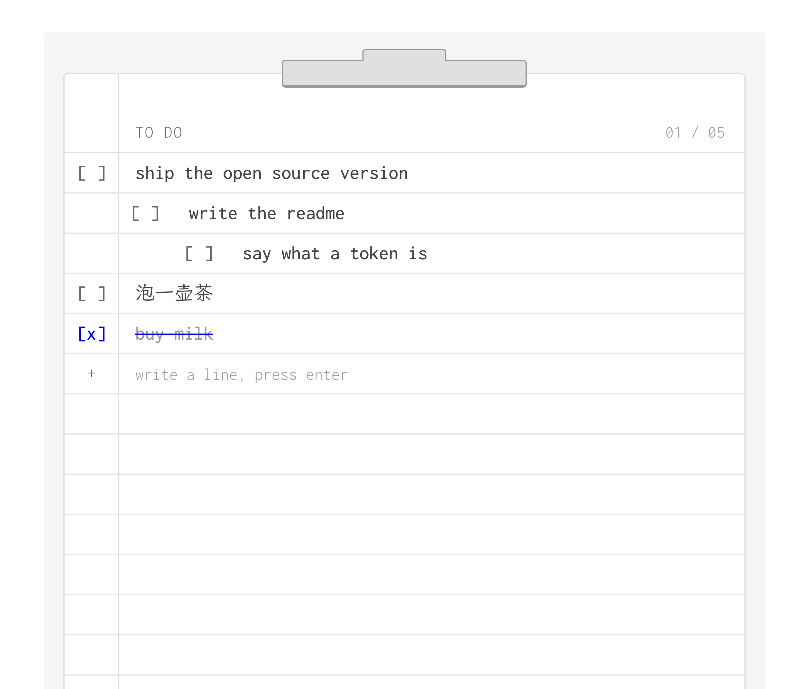

# todos

A shared clipboard. One token, one list, anyone with the link.

**[todos.cjj.li](https://todos.cjj.li)** — live, no sign-up

No accounts, no sign-up, no password. The token in the URL *is* the list:
`todos.cjj.li/?t=quiet-otter-42` opens that list and nothing else. Send the
link, and whoever has it can read and write with you, live.



## What it is

One HTML file and one serverless function. The whole thing is a piece of ruled paper
clipped to a board: write a line, press enter, cross it out. Completing a line pops
pixels; clearing the board fires both cannons.

- **Write** a line and press enter
- **Cross it out** by clicking anywhere on the row
- **Indent** with `Tab` (three levels; each line is completable on its own)
- **Rewrite** a line with `~`, **remove** it with `−`
- **Restore** anything from the drawer of deleted lines
- Works offline; syncs when it can

## The access model, stated plainly

**A token is a capability, not a password.** Whoever holds the link holds the list.
There is no other check.

- A **generated** token is 10 characters of `crypto.getRandomValues` (~50 bits). Nobody
  will guess it. Treat the link the way you would treat a Google Docs "anyone with the
  link" URL.
- A token **you type in yourself** is a room name, not a secret. `team` is a list anyone
  can open by typing `team`. That is a feature if you meant to share a pad with
  colleagues and a mistake if you meant it to be private.
- Lists are not encrypted. Whoever runs the deployment can read them. Do not put
  anything in here you would not put in a shared doc.
- A list nobody opens for about 13 months expires.

## Run it

Storage is any Upstash-compatible Redis over its REST API.

```bash
git clone https://github.com/jajamoa/todos
cd todos
vercel link
```

(That is how [todos.cjj.li](https://todos.cjj.li) itself is deployed.)

Then add a Redis store (Vercel dashboard → Storage → Upstash Redis), which injects the
env vars for you. Any of these pairs works:

| | |
|---|---|
| `KV_REST_API_URL` | `KV_REST_API_TOKEN` |
| `UPSTASH_REDIS_REST_URL` | `UPSTASH_REDIS_REST_TOKEN` |
| `UPSTASH_URL` | `UPSTASH_TOKEN` |

```bash
vercel deploy --prod
```

That is the entire setup. There is no build step and no dependencies.

## How it works

**Storage.** One JSON doc per list at `todos:<token>`. `localStorage` is a cache, not
the record — it is per-browser, and Safari evicts script-writable storage after 7 days
of not visiting the site.

**Sync.** A `PUT` is a proposal, not an overwrite. The server unions both docs per item
and keeps whichever side touched an item last. The trash doubles as the tombstone set,
which is what stops one device's delete from being resurrected by another device that
still has the row; restoring re-stamps `updatedAt` past `deletedAt` so it wins by the
same rule. Two people editing the same list converge without a lock.

**Presence.** A sorted set per list, scored by timestamp, trimmed to the last 30
seconds. `ZCARD` is the number of people here. It rides on the poll the client already
makes, so there is no second endpoint and no socket.

**Order and indent.** Row order is the array. Indent is a property of the *line*, not a
link to a parent: an outline, not a tree. So deleting a line leaves the lines under it
exactly where they were, the way it works in any text editor, and there is no cascade
and no orphan to adopt.

## Design

The look is a house style: Inconsolata and LXGW WenKai, one narrow column, near
monochrome. Blue is the pen — it is the page's only colour and it marks exactly one
thing, what *you* did. Everything printed on the form is grey.

The checkbox is `[ ]` and `[x]` set in the text font, not a widget. Delete is `−`, add
is `+`, rewrite is `~`: the diff vocabulary, which is the only vocabulary the page has.

## License

MIT
